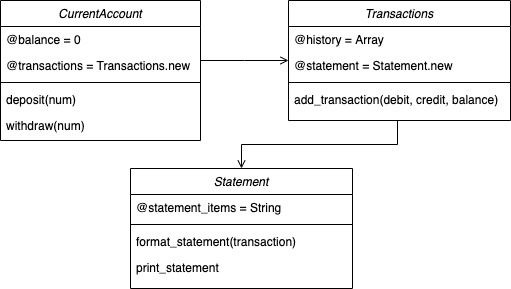

# Bank Tech Test
This is an implementation of the tech test, following these specifications:

### Requirements

* You should be able to interact with your code via a REPL like IRB or the JavaScript console.  (You don't need to implement a command line interface that takes input from STDIN.)
* Deposits, withdrawal.
* Account statement (date, amount, balance) printing.
* Data can be kept in memory (it doesn't need to be stored to a database or anything).

### Acceptance criteria

**Given** a client makes a deposit of 1000 on 10-01-2023  
**And** a deposit of 2000 on 13-01-2023  
**And** a withdrawal of 500 on 14-01-2023  
**When** she prints her bank statement  
**Then** she would see

```
date || credit || debit || balance
14/01/2023 || || 500.00 || 2500.00
13/01/2023 || 2000.00 || || 3000.00
10/01/2023 || 1000.00 || || 1000.00
```

## How to use
* `git clone` this repository and run the following commands
```
cd bank-tech-test
bundle install
irb
require './lib/transactions'
require './lib/currentaccount'
require './lib/statement'
account = CurrentAccount.new  #creates a new account with a default balance of 0 that you can deposit or withdraw from
```
* While in `irb` you can then use the methods `account.deposit(num)`, `account.withdraw(num)` where `num` is any number then add the existing transactions to a statement of transactions using `account.transactions.create_statement` which adds the transactions to a formatted statement read for printing.
* You can then call `account.transactions.statement.print_statement` to print the statement to the console

## Domain Model
* This was implemented across 3 classes `CurrentAccount`, `Transactions` and `Statement` to respect the SR principle. A domain model representing the implementation:




## Approach and testing
* To run the testing suite, run `rspec` from the command line
* A TDD process was followed to tackle this, first creating a `CurrentAccount` class that accepts deposits and withdrawals before moving to `print_statement`
* In order to not violate the SR principle, the ability to print statements was extracted to a new `Transactions` class, which is responsible for storing the history and printing them to prevent everything existing in one class.
* This was then further extracted to a `Statements` class so that the `CurrentAccount` iss only responsible for the balance, the `Transactions` class is only responsible for persisting transactions and `Statement` is responsible for printing the statement once created.